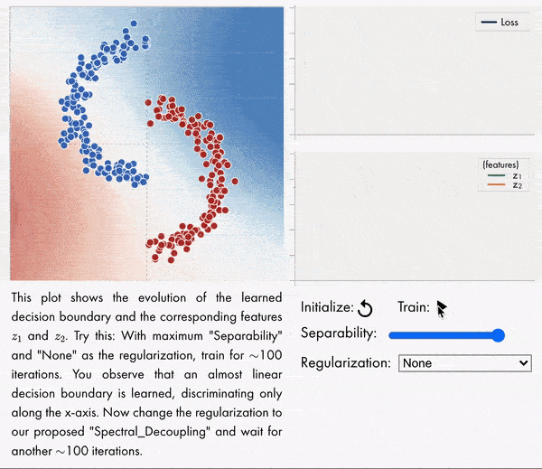

# Gradient_Starvation
This repo implements the experiments provided in the following paper:

> Mohammad Pezeshki, Sékou-Oumar Kaba, Yoshua Bengio, Aaron Courville, Doina Precup, Guillaume Lajoie
> [Gradient Starvation: A Learning Proclivity in Neural Networks](https://arxiv.org/abs/2011.09468)

The provided code for each figure or table is standalone and does not depend on other folders. This has resulted in code repetition but facilitates reusability. To run the code, simply run the main `.sh` or `.py` file.

### Blog post
Check out our interactive blog post [here](https://mohammadpz.github.io/GradientStarvation.html).


### Requirements:
- python 3.6.8
- matplotlib 3.0.3
- numpy 1.16.2
- pandas 0.24.2
- pillow 5.4.1
- pytorch 1.1.0
- pytorch_transformers 1.2.0
- torchvision 0.5.0a0+19315e3
- tqdm 4.32.2
- [nngeometry](https://github.com/tfjgeorge/nngeometry)

### BibTeX
```
@article{pezeshki2020gradient,
title={Gradient Starvation: A Learning Proclivity in Neural Networks},
author={Pezeshki, Mohammad and Kaba, Sékou-Oumar and Bengio, Yoshua and Courville, Aaron and Precup, Doina and Lajoie, Guillaume},
journal={arXiv preprint arXiv:2011.09468},
year={2020}}
```
